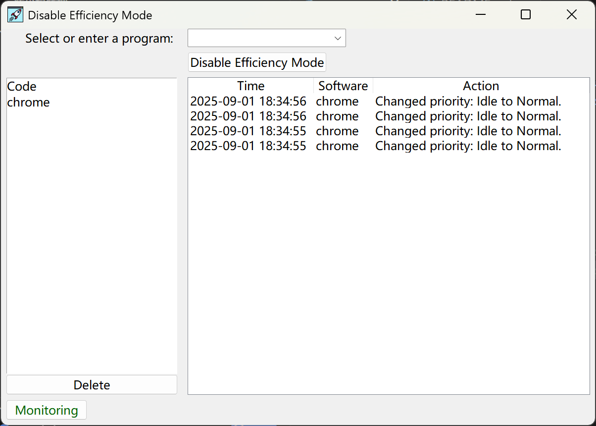

# Efficiency Mode Monitor
The issue can be resolved using the method described here: [https://www.reddit.com/r/Windows11/comments/1kgp7ar/cause_and_solution_to_windows_24h2_related/]. Therefore, the original purpose of creating this program has been perfectly addressed. However, you can still use this program to solve other efficiency mode-related issues.

Efficiency Mode Monitor is a simple tool that monitors specific application processes. If a process is detected running with Idle priority, the program will automatically adjust it to Normal priority to improve performance. This is especially useful for users experiencing browser lag when running in efficiency mode, as the tool helps alleviate such issues.

## Usage
- Command-Line Mode: Run the PowerShell script `app.ps1`.
- Graphical Interface Mode: Double-click the `app.exe` file to launch the application.

## Source Code
The source code is available in the `app.py` file for developers to review and modify.

## Icon
[Launch icons created by mynamepong - Flaticon](https://www.flaticon.com/free-icons/launch)
